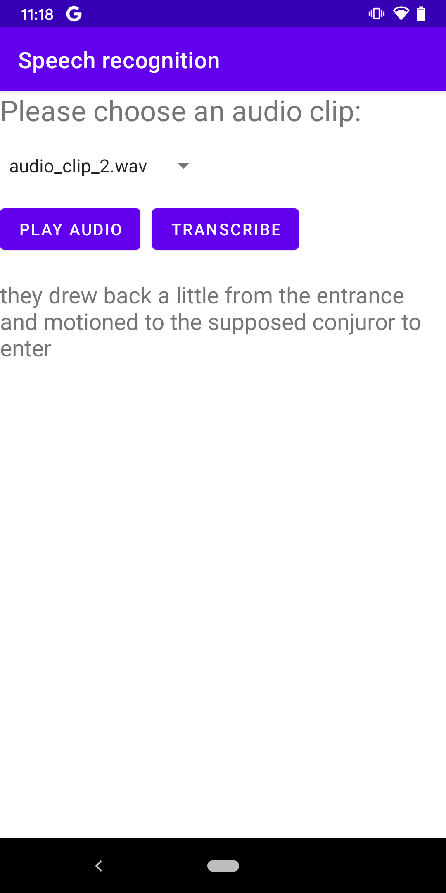

# tflite-asr
An Android example app that demos how to use TFLite to do Automatic Speech Recognition on-device

The model is CONFORMER from [TF Hub](https://tfhub.dev/neso613/lite-model/ASR_TFLite/pre_trained_models/English/1). Test audio clips are from [LibriSpeech](https://www.openslr.org/12) clean test set.

Please refer to the original [python notebook](https://github.com/neso613/ASR_TFLite/blob/main/scripts/subword-conformer.latest_for_english_inference.ipynb) to see how the model works.

